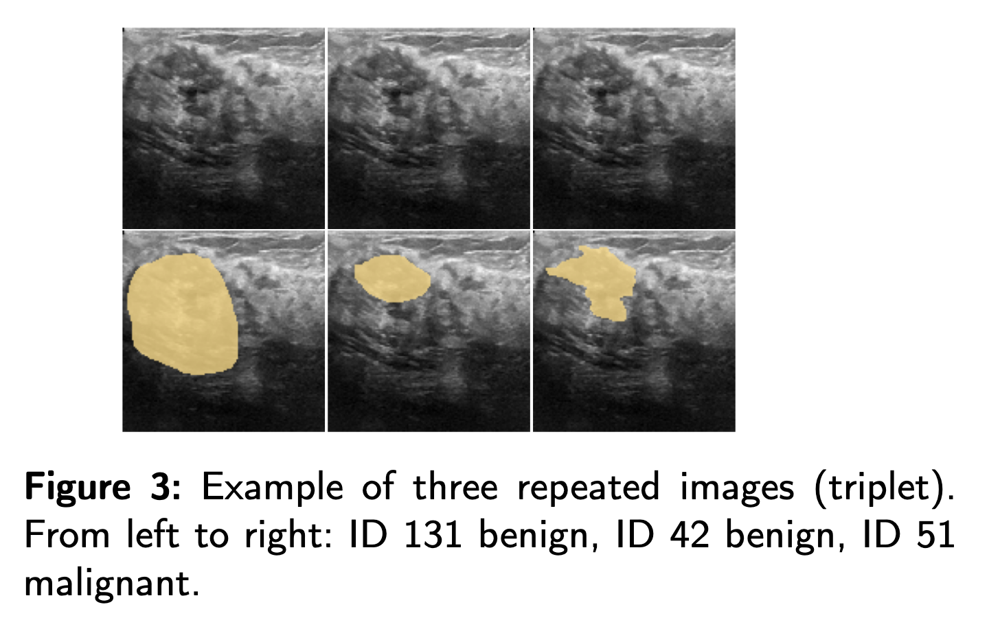
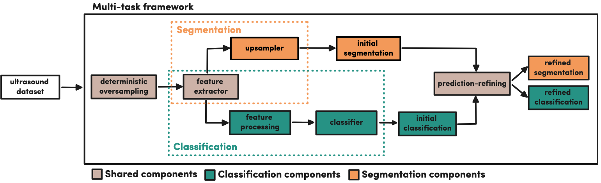
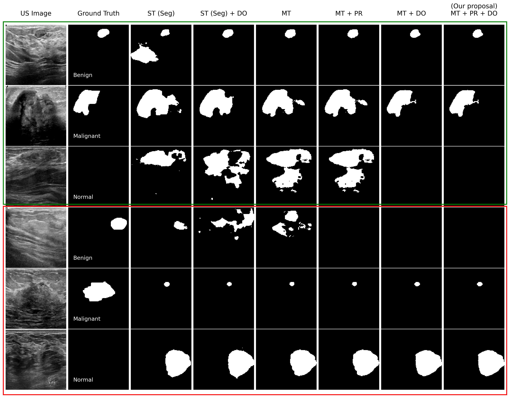

# A multi-task framework for breast cancer segmentation and classification in ultrasound imaging

## Overview
This research work presents a novel multi-task framework designed to simultaneously address segmentation and 
classification of breast cancer in ultrasound (US) imaging. The proposed framework leverages correlations between 
these tasks to enhance accuracy, reducing biases often present in single-task methodologies. It also includes a 
comprehensive analysis of the BUSI dataset, identifying inconsistencies and proposing a curated version to ensure 
fairness and reliability in future research.

The main contributions of the work are the following:

- We built a CAD system for breast cancer that exploits the existing correlations between segmentation and classification tasks, and proves its clinical application in practice.
- We performed an exhaustive ablation study to demonstrate how our multi-task framework outperforms single-task methods regardless of the backbone model chosen.
- We developed a duplicated image recognition algorithm to uncover inconsistencies in a widely used public breast cancer dataset. As a result, we also provide a curated version of this dataset to ensure fairness in the performance analysis of future research works.

## Data - Curated BUSI Dataset
The Breast UltraSound Imaging (BUSI) dataset, originally published in 2020, comprises 780 ultrasound images labeled into
three categories: normal (17.1%), benign (56.0%), and malignant (26.9%). Each image is accompanied by expert-provided 
segmentation masks for benign and malignant cases.

While widely used, BUSI dataset presented significant challenges, including duplicated images, annotation 
inconsistencies, and an imbalance in class distribution, which could bias model evaluations. To address these issues,
a Duplicate image recognition algorithm is proposed in this work by leveraging the Structural Similarity Index Measure
(SSIM) to detect and analyze visually identical images.

Identified 330 duplicated cases were removed to avoid bias training or testing performance:
- 5 quadruplets (4 identical images each)
- 22 triplets (3 identical images each)
- 122 duplets (2 identical images each)

Curated BUSI:

After removing duplicates and inconsistent annotations, the Curated BUSI dataset contains 450 images: 64 normal 
(14.2%), 222 benign (49.3%), and 164 malignant (36.4%). This curated dataset ensures fairness and reliability in model training and evaluation.

## Methodology 

The proposed framework is a multi-task learning model designed to simultaneously handle breast cancer segmentation and 
classification in ultrasound images. By integrating these tasks, the model leverages the inherent relationships between
them to improve performance and ensure consistency, offering a more efficient solution than traditional single-task approaches.

Key Components
- Deterministic Oversampling: To handle class imbalance in the training data, the framework employs a deterministic oversampling module. This module adjusts the class distribution by calculating a replication factor for each class based on its proportion in the dataset, ensuring balanced data without introducing randomness.
- Feature Extraction: The model uses a flexible backbone architecture, such as U-Net++ or nnU-Net, to extract features from ultrasound images. The encoder path generates feature maps are shared across the segmentation and classification tasks.
- Prediction Refinement: A prediction-refining module ensures consistency between the segmentation and classification outputs

The segmentation branch reconstructs segmentation masks from the extracted features using an upsampler that restores 
spatial resolution. The classification branch uses the same extracted features to classify the image as normal, benign, or malignant.

The framework optimizes both tasks simultaneously using a combined multi-task loss. This loss is a weighted sum of the 
dice loss function and focal loss function, controlled by a hyperparameter 𝜆, which balances the importance of each task
during training.

## Results

The ablation study for the proposed prediction-refining multi-task framework evaluated using the Curated BUSI dataset 
revealed significant improvements across segmentation and classification tasks compared to various baseline configurations.

| Segmentation Classification     |     DSC Benign     |   DSC Malignant    |    DSC Normal     |   DSC Average    |    F1 Benign     |  F1 Malignant    |   F1 Normal      |  F1 Weighted     |      ACC         |
|---------------------------------|:------------------:|:------------------:|:-----------------:|:----------------:|:----------------:|:----------------:|:----------------:|:----------------:|:----------------:|
| ST (Seg)                        |   0.793 ± 0.024    |  0.720 ± 0.084     |   0.000 ± 0.000   |  0.653 ± 0.019   |        -         |         -         |        -          |         -         |         -        |
| ST (Seg) + DO                   |   0.773 ± 0.047    |  0.698 ± 0.070     |   0.594 ± 0.194   |  0.720 ± 0.031   |        -         |         -         |        -          |         -         |         -        |
| ST (Cls)                        |    -               |         -           |         -         |         -         |  0.740 ± 0.025   |  0.665 ± 0.052   |  0.276 ± 0.271   |  0.647 ± 0.060   |  0.680 ± 0.043   |
| ST (Cls) + DO                   |         -          |         -           |         -         |         -         |  0.742 ± 0.027   |  0.721 ± 0.035   |  0.618 ± 0.112   |  0.717 ± 0.033   |  0.720 ± 0.028   |
| ST (Seg + Cls) + PR             |   0.783 ± 0.027    |  0.715 ± 0.082     |   0.219 ± 0.282   |  0.678 ± 0.054   |  0.740 ± 0.025   |  0.665 ± 0.052   |  0.276 ± 0.271   |  0.647 ± 0.060   |  0.680 ± 0.043   |
| ST (Seg + Cls) + PR + DO        |   0.747 ± 0.039    |  0.694 ± 0.067     |   0.766 ± 0.164   |  0.730 ± 0.034   |  0.758 ± 0.026   |  0.725 ± 0.031   |  0.756 ± 0.086   |  0.746 ± 0.021   |  0.747 ± 0.021   |
| MT                              |   0.806 ± 0.041    |  0.722 ± 0.056     |   0.141 ± 0.281   |  0.681 ± 0.034   |  0.770 ± 0.033   |  0.747 ± 0.029   |  0.655 ± 0.025   |  0.745 ± 0.029   |  0.747 ± 0.028   |
| MT + PR                         |   0.783 ± 0.038    |  0.721 ± 0.058     |   0.656 ± 0.108   |  0.742 ± 0.017   |  0.773 ± 0.034   |  0.747 ± 0.029   |  0.674 ± 0.055   |  0.750 ± 0.032   |  0.751 ± 0.031   |
| MT + DO                         |   0.762 ± 0.054    |  0.696 ± 0.080     |   0.672 ± 0.180   |  0.725 ± 0.031   |  0.795 ± 0.045   |  0.752 ± 0.022   |  0.696 ± 0.095   |  0.765 ± 0.032   |  0.769 ± 0.034   |
| **MT + PR + DO (Our proposal)** |   0.779 ± 0.046    |  0.717 ± 0.049     |   0.766 ± 0.103   |  0.754 ± 0.035   |  0.806 ± 0.005   |  0.751 ± 0.040   |  0.741 ± 0.109   |  0.777 ± 0.019   |  0.780 ± 0.017   |

Key findings:

- Unified Multi-Task Approach (MT): The proposed approach outperformed all single-task configurations.
- Prediction Refining and Deterministic Oversampling: Incorporating both the Prediction Refinement (PR) module and Deterministic Oversampling (DO) improved model performance across all metrics.
- Consistency and Robustness: The MT framework reduced inconsistencies between benign, malignant, and normal predictions, as well as false positives and false negatives, enhancing accuracy and model robustness.
- Clinical applicability: The methodology showcases better generalization capabilities, crucial for clinical applications in breast cancer detection.

Qualitative results are displayed below:

## Conclusions

We can conclude that our novel multi-task learning framework for breast cancer segmentation and classification in 
ultrasound images. The framework effectively combines both tasks, leveraging shared features to improve model 
performance. By incorporating a prediction-refining module and a deterministic oversampling strategy, the model 
achieved significant improvements in segmentation accuracy and classification consistency compared to traditional 
single-task approaches.

## References

- W. Al-Dhabyani, M. Gomaa, H. Khaled, A. Fahmy, Dataset of breast ultrasound images, Data in brief 28 (2020) 104863.
- F. Isensee, P. F. Jaeger, S. A. Kohl, J. Petersen, K. H. Maier-Hein, nnU-Net: a self-configuring method for deep learning-based biomedical image segmentation, Nature Methods 18 (2) (2021) 203–211.
- Z. Zhou, M. M. Rahman Siddiquee, N. Tajbakhsh, J. Liang, UNet++: A Nested U-Net Architecture for Medical Image Segmentation, in: 4th International Workshop on Deep Learning in Medical Image Analysis and Multimodal Learning for Clinical Decision Support, Held in Conjunction with MICCAI 2018, Proceedings 4, Springer, 2018, pp. 3–11.

